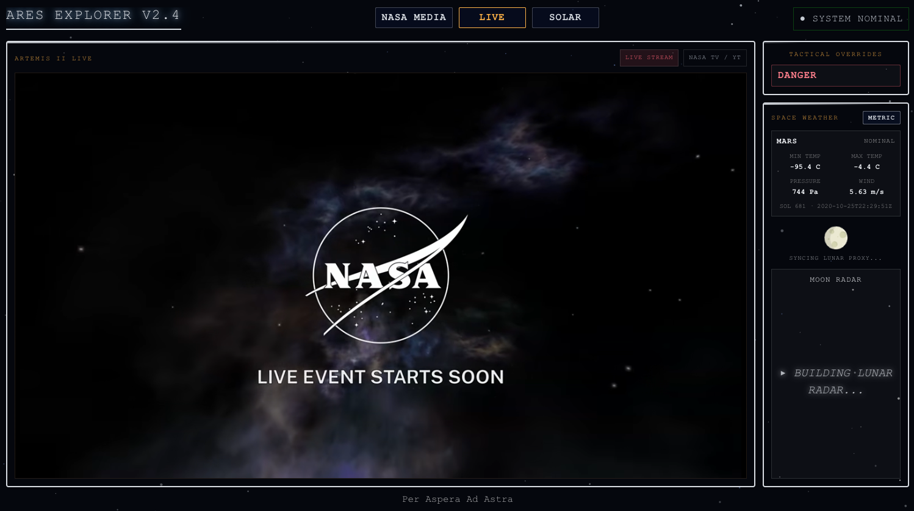
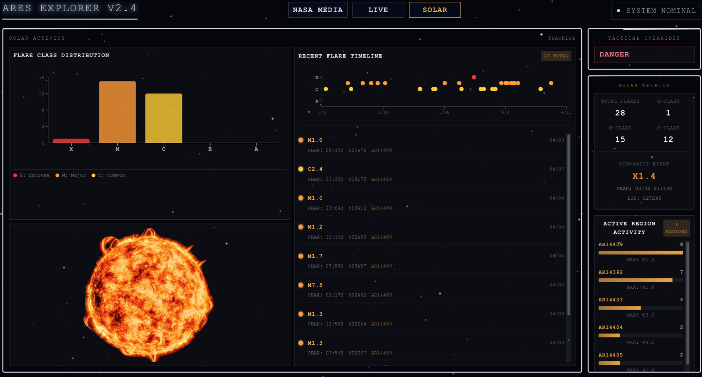

# NASA Explorer

NASA Explorer is a full-stack space data dashboard built on NASA's public APIs. It combines a React frontend interface with an NodeJS / Express backend that aggregates, validates, and normalizes data for astronomy media, near-Earth object tracking, Earth imagery, and planetary telemetry.

Try the application here: [NasaExplorer](https://nasa-explorer-ndnd.vercel.app/)

## App Screens Preview


(https://github.com/user-attachments/assets/82ec0b47-310f-4be8-89f6-cb4d2a0a35bd)
## Overview

The application is organized around three primary user views:

- `NASA MEDIA`: Search NASA's media library and inspect asset metadata.
- `LIVE`: Follow live the adventure of the four astronauts on the Artemis II.
- `SOLAR`: Monitor solar flares anch check the active region activity.
- `DANCGER`: Are you adventerous enough to click that button?

The backend acts as a service layer between the frontend and NASA APIs. It centralizes request validation, rate limiting, security middleware, error handling, and data transformation so the frontend can render consistent datasets.

### Frontend

- `React 19.2.4`
- `Vite 8`
- `React Router 7`
- `Recharts 3`
- `Tailwind CSS 4`
- CSS Modules for components' styling

### Backend

- `Node.js`
- `Express 4`
- `Axios`
- `Helmet`
- `CORS`
- `express-rate-limit`
- `express-validator`

## Requirements

Before running the project locally, ensure you have:

- `Node.js 18` or later
- `npm 9` or later
- A NASA API key from `https://api.nasa.gov/`

## Quick Start

This repository is split into separate frontend and backend applications. Install dependencies in each directory.

### 1. Install dependencies

```bash
cd backend
npm install

cd ../frontend
npm install
```

### 2. Configure environment variables

Create a `.env` file inside `backend/`:

```bash
NASA_API_KEY=your_nasa_api_key
PORT=3001
NODE_ENV=development
ALLOWED_ORIGINS=http://localhost:5173
```

Optional: create a `.env` file inside `frontend/` when the frontend should target a remote backend instead of relying on the Vite dev proxy.

```bash
VITE_API_BASE_URL=http://localhost:3001
```

### 3. Start the backend

```bash
cd backend
node server.js
```

### 4. Start the frontend

```bash
cd frontend
npm run dev
```

Then open `http://localhost:5173` in your browser.

## Deployment

This project is designed to be deployed as two separate services: the Express backend on Render and the React frontend on Vercel.

### Deploy the backend to Render

1. Create a new Web Service on [Render](https://render.com/).
2. Connect your repository and select the `prod` branch .
3. Configure the service:
4. Deploy and note the service URL 

### Deploy the frontend to Vercel

1. Create a new project on [Vercel](https://vercel.com/).
2. Connect your repository and select the `dev` branch.
3. Configure the project:
4. Deploy and visit the provided URL.

## License

This project is licensed under the terms of the `LICENSE` file in the repository root.
